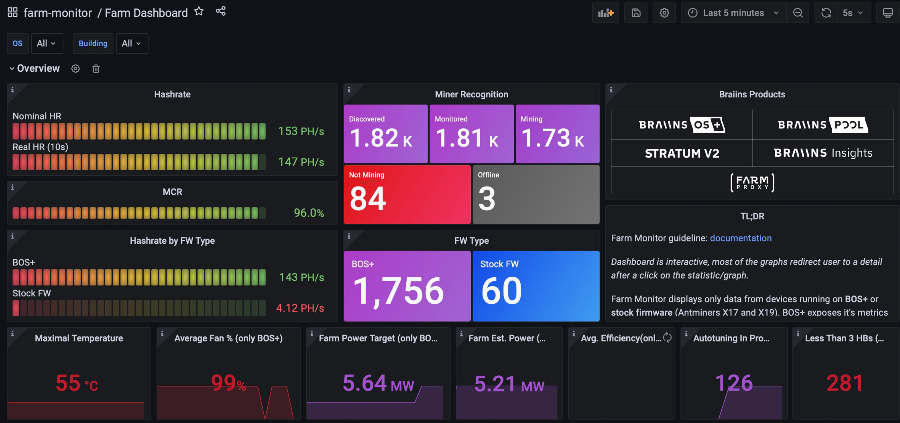

# Braiins Farm Monitor


## Introduction
Braiins is providing to the mining world a free monitoring solution **Braiins Farm Monitor**. Braiins Farm Monitor encompasses three primary components:
* Metrics Exporter
* Prometheus
* Grafana

Go to [Braiins Academy](https://academy.braiins.com/en/farm-monitor/about) for the full documentation.



## Quick Start
1. Clone the git repository git clone https://github.com/braiins/farm-monitor.git
2. Go to the farm-monitor repository `cd farm-monitor`
3. Define IP address ranges for the device discovery in the config file `./monitoring/metrics_exporter/metrics-exporter.toml`
4. Run monitoring with the command `docker-compose up -d`
5. Open URL http://localhost:3000 to see the Farm Dashboard in Grafana

## Farm Monitor Distribution
Farm Monitor can be currently run on Linux OS as a multiplatform software:
* AMD 64bit
* ARM 64bit
* ARMv7

## Prerequisites
At the beginning it is required to install a couple of prerequisites:

* Docker
* Docker Compose
* Git

## Configuration
Braiins Farm Monitor has to be configured in the config file `./monitoring/metrics_exporter/metrics-exporter.toml`.

### Example Configuration
Configuration for a farm, where miners have IP addresses in the IP ranges `1.2.0.*`, `1.2.*.2`, `1.3.0.*` and `1.3.*.2`.

```
# scraping internal for stock FW devices, scraping interval for BOS+ devices is defined in the monitoring/promethus/prometheus.yml (default is also 5s)
[scraping]
stock_fw_scrape_interval = "1m"

# ranges needs to be defined by user, name of the ranges is then used as Prometheus label
# naming is arbitrary
# number of ranges is also arbitrary
[ranges]
Building_A = ["1.2.0.*","1.2.*.2"]
Building_B =["1.3.0.*","1.3.*.2"]

# credentials needed only for http API, cgminer API doesn't require credentials
# default credentials are root/root, if the user is using another credentials, it has to be edited and uncommented here
#[credentials]
#username = "root"
#password = "root"

[advanced]
# interval for scanning period
scan_interval = "5m"
# timeout interval for scanning
scan_timeout = "15s"
# maximal number of parallel scan requests
scan_max_concurrency = 1000
# timeout interval for scraping stock FW devices
stock_fw_scrape_timeout = "5s"
# maximal number of parallel scrape requests for stock FW devices
stock_fw_scrape_max_concurrency = 40000
```


